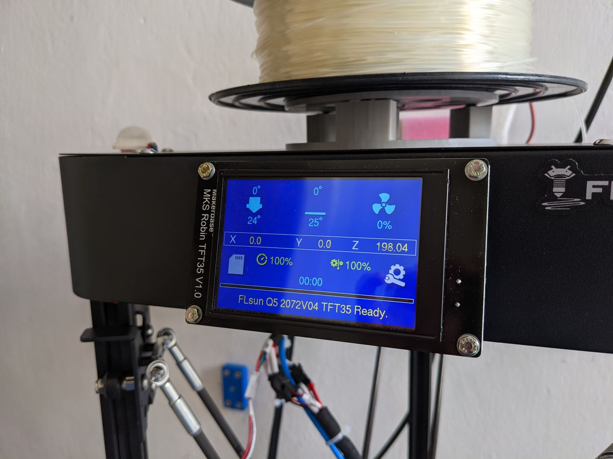
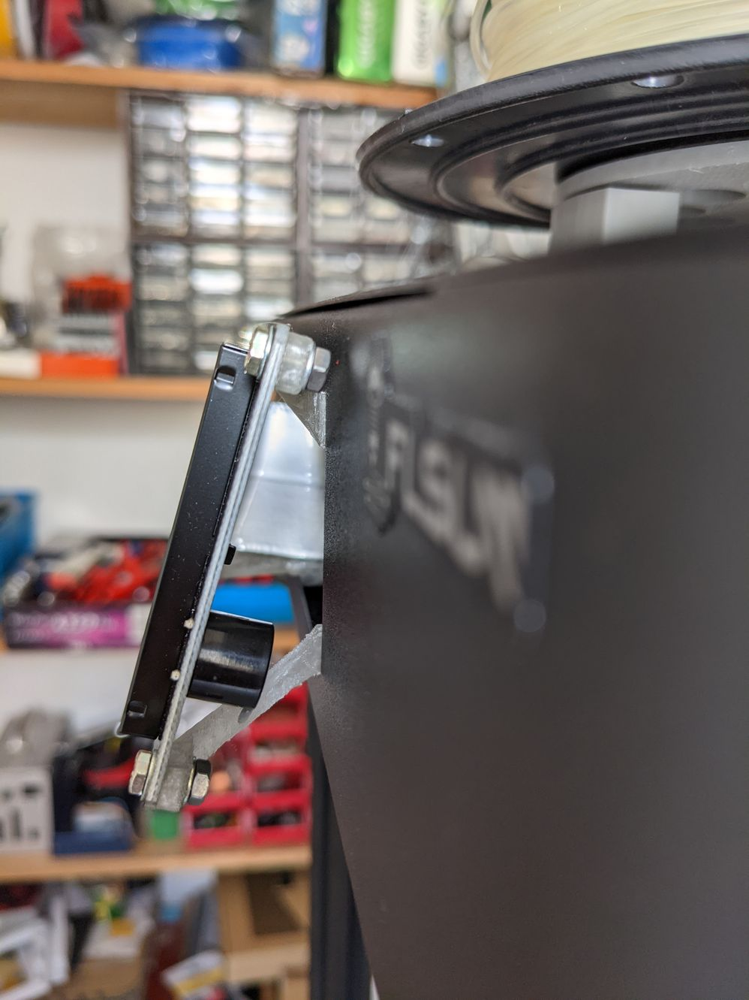
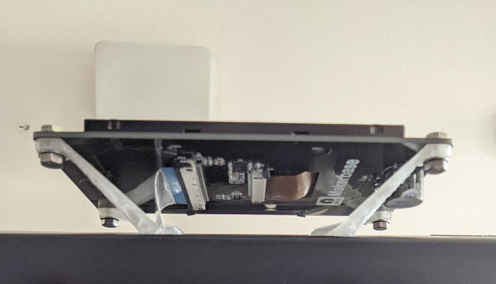
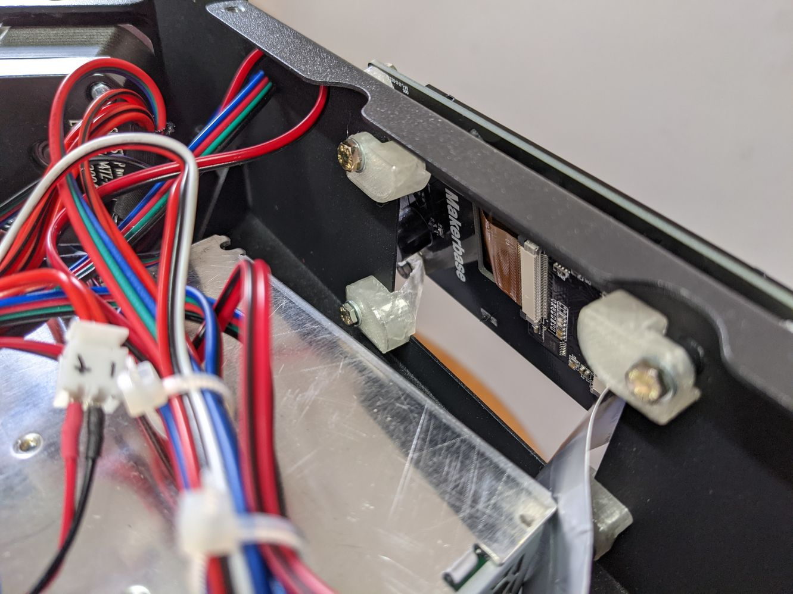
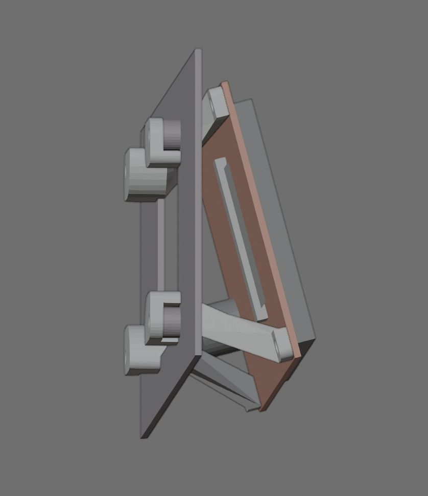
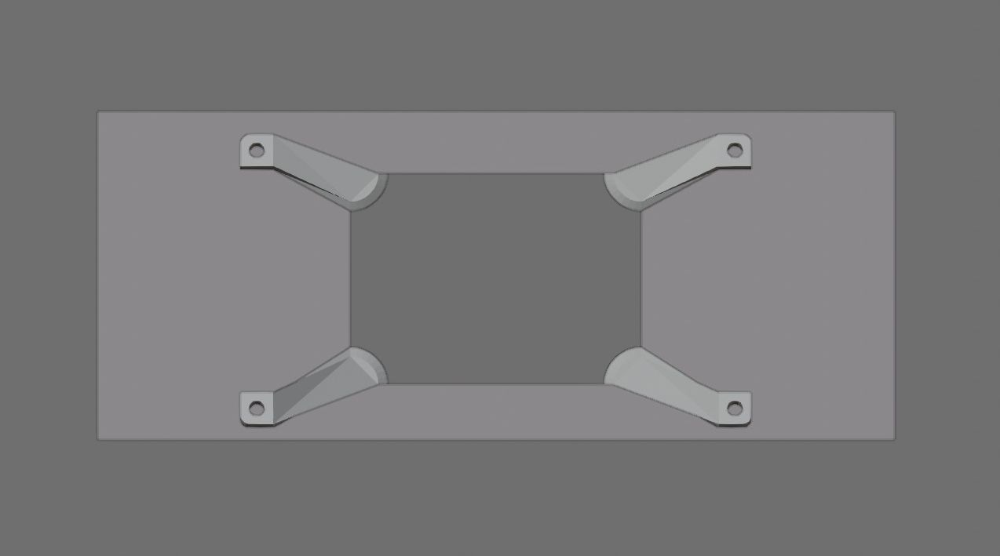
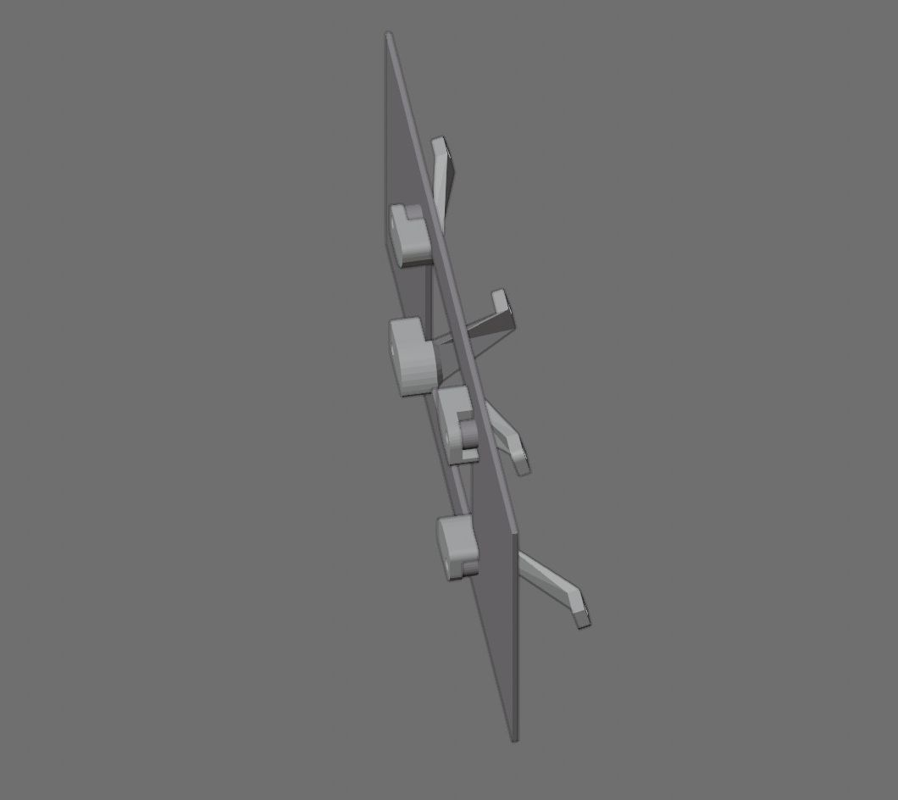
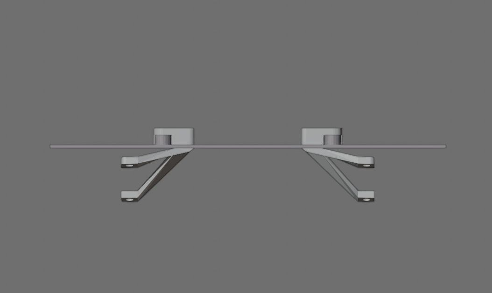

# **FLSUN Q5 3.5" Display**

## A bigger display for the FLSUN Q5

<br>

### Summary
Four brackets at the corners of the control box's display opening are screwed to the existing thread holes. The bracket's arms lead through the opening, holding a Makerbase MKS Robin TFT35 3.5" LCD display at an angle of 15 degrees for convenient operation.

<br>

### Print
The brackets should be rotated appropriately to minimize support structures. To produce sturdy parts the infill rate should be at least 25 %. After printing the support material has to be removed, especially the 1.5 mm slits that should fit to the control box opening sheet might need a slight  rework with a warding file.

<br>

### Assembly
The existing 2.4" LCD is removed by unscrewing four fixing screws and unplugging the ribbon cable. To gain some more space for fingers and tools, the power supply's housing might be loosened. The brackets are screwed to the original display's thread holes at the inside of the control box. For easier fastening M3 screws preferable with hexagonal heads can be used. The new LCD is connected to the ribbon cable and its PCB fixed with four M3 screws, washers and nuts to the brackets. The ribbon cable might be relocated to utilize its full length.

<br>

### Marlin configuration

480 x 320 resolution must be activated
```
#define TFT_480x320
```

the display is rotated 180 degree
```
#define TFT_ROTATION TFT_ROTATE_180         
```

these values might do as a starting point, the exact values can be found by issuing marlin M995 command
```
#define TOUCH_CALIBRATION_X     17191
#define TOUCH_CALIBRATION_Y     -11709
#define TOUCH_OFFSET_X          -34
#define TOUCH_OFFSET_Y          332
#define TOUCH_ORIENTATION       TOUCH_LANDSCAPE
```
<br>

### Files
[-> 3d print](stl)

<br>

### Thingiverse

<br>

---

<br>

## Views

Mounted display  

<br>
<br>

Side  

<br>
<br>

Bottom  

<br>
<br>

Control box inside  

<br>
<br>

## Renders

Side with TFT  

<br>
<br>

Front  

<br>
<br>

Top Side  

<br>
<br>

Top  

<br>
<br>

<br>
<br>

---

[qrt@qland.de](mailto:qrt@qland.de) 210716
